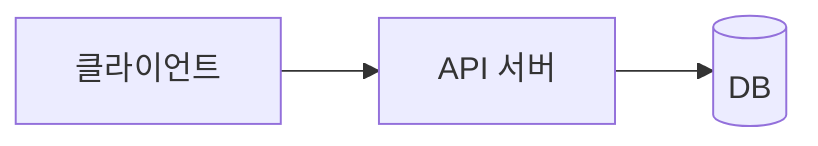

# 아키텍처

<!-- 전역 문서. 도메인 설계가 추가될 때마다 갱신한다 -->

## 구성도

## 구성 요소

| 구성 요소 | 책임 | 기술 |
|---|---|---|

## 기술 스택

| 영역 | 선택 | 근거 |
|---|---|---|
| <프론트엔드> | <기술> | CON-NNN |

## 모듈 경계와 의존 방향

- <모듈 목록과 허용하는 의존 방향. 예: ui → application → domain, domain은 아무것도 의존하지 않는다>

## UI

- 프론트 키트: `harness-psw-frontend` <태그>, 테마 <이름>, 프레임워크 <이름> 〔YYYY-MM-DD〕 <이유>
- 테마 파일: <예: frontend/app/theme.css>
- 컴포넌트 코드: <예: frontend/components/ui/>
- 셸: <형태, 예: 사이드바형>, 설정 <예: 왼쪽 · 아이콘만 남김 · 벽에 붙음 · 펼침> 〔YYYY-MM-DD〕 <이유>. 목업 셸 `ui/kit/shell.js`
- 셸 코드: <예: frontend/components/app-sidebar.tsx, frontend/app/layout.tsx>

## 백엔드

- 백엔드 키트: `harness-psw-backend` <태그>, 프레임워크 <이름>, 헬퍼 <목록 또는 없음>, 패키지 <이름> 〔YYYY-MM-DD〕 <이유>
- 코드 루트: `backend/`
- DB 마이그레이션: <예: backend/src/main/resources/db/migration/>. 구현자는 새 파일만 추가하고 이미 있는 파일은 고치지 않는다
- 테스트 위치: <예: backend/src/test/>. `.claude/psw.conf`의 `PSW_TEST_GLOBS`에 넣는다
- 골격 테스트 조정: <예: 로그인 FR에서 테스트용 인증 주체 조회를 지우고 실제 계정으로 바꾼다 (키트 APPLY.md "사용자 도메인에서 할 일")>

## 외부 연동

<!-- 연동 요구사항(docs/req/integration/)을 받는다. 시스템마다 절을 둔다. 없으면 "해당 없음" -->

### <외부 시스템 이름>

- 근거: <INT-PG-001>
- 용도와 방향: <결제 승인. 우리 → 외부 / 외부 → 우리(웹훅)>
- 인증: <API 키, 서명 방식. 키 값은 적지 않는다>

| 작업 | 엔드포인트 | 타임아웃 | 재시도 | 멱등 키 |
|---|---|---|---|---|

| 실패 | 처리 | 보상 |
|---|---|---|
| <타임아웃> | <결제 실패로 처리하고 B001 응답> | <승인 취소 요청> |

- 테스트 환경: 샌드박스 <있음 / 없음>, 키 준비 <준비됨 / 대기 [OPEN-NNN]>

## 배포 단위

| 단위 | 대상 | 비고 |
|---|---|---|

- 시크릿 저장소: <프로젝트별 결정> 〔YYYY-MM-DD〕 <이유>

## 적용 요구사항

- <아키텍처로 해결하는 NFR·SEC·INT ID와 방법>

## 금지·제약

- <예: 도메인 계층에서 외부 SDK를 직접 호출하지 않는다>
