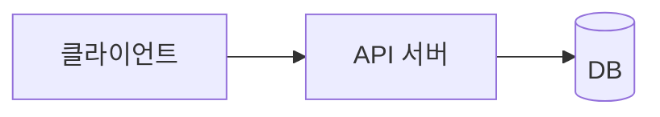

# 아키텍처

<!-- 전역 문서. 도메인 설계가 추가될 때마다 갱신한다 -->

## 구성도

## 구성 요소

| 구성 요소 | 책임 | 기술 |
|---|---|---|

## 기술 스택

| 영역 | 선택 | 근거 |
|---|---|---|
| <프론트엔드> | <기술> | CON-NNN |

## 모듈 경계와 의존 방향

- <모듈 목록과 허용하는 의존 방향. 예: ui → application → domain, domain은 아무것도 의존하지 않는다>

## UI 패키지

- 경로: <프로젝트별 결정> (DEC-NNNN)

## 배포 단위

| 단위 | 대상 | 비고 |
|---|---|---|

- 시크릿 저장소: <프로젝트별 결정> (DEC-NNNN)

## 적용 요구사항

- <아키텍처로 해결하는 NFR·SEC·INT ID와 방법>

## 금지·제약

- <예: 도메인 계층에서 외부 SDK를 직접 호출하지 않는다>
