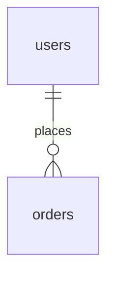

# ERD

<!-- 전역 문서. 테이블마다 "### <테이블 이름>" 제목을 둔다 (crosscheck.sh가 읽는다) -->

## 명명 규칙

- 테이블: <예: 복수형 snake_case>
- 컬럼: <예: snake_case, FK는 <테이블 단수>_id>
- 용어는 `docs/glossary.md`의 코드 이름을 따른다

## 다이어그램

## 테이블

### <orders>

- 설명: <한 줄>
- 삭제 정책: soft / hard (<hard면 이유>)  <!-- soft가 기본이다 (harness-psw 4.7) -->
- refs: <FR-ORD-001>

| 컬럼 | 타입 | null | 기본값 | 설명 |
|---|---|---|---|---|
| id | <bigint> | N | | PK |
| status | <varchar(30)> | N | <PENDING_PAYMENT> | 상태. 값의 정본은 `state/<order>.md` |

- PK: <id>
- FK: <user_id → users.id>
- 인덱스: <(user_id, created_at)>
- 유니크: <없음>
