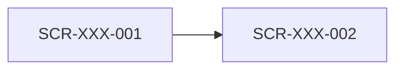

# 정보 구조 (IA)

<!-- 색인·메뉴·흐름만 둔다. 화면 목록은 도메인별 파일(<domain>.md)이 소유한다 (harness-psw 4.4) -->

## 도메인 색인

| 도메인 | 화면 목록 | 화면 수 |
|---|---|---|
| <ORD> | `<order>.md` | <N> |

- 시안: `../screens/<domain>/<screen>.html`, 화면당 한 장

## 셸 없는 화면

<!-- 셸(../kit/shell.js)을 불러오지 않는 화면. 없으면 "없음" -->

- <SCR-XXX-NNN (로그인)>

## 메뉴 계층

```text
<홈>
├─ <상품>
└─ <마이페이지>
   └─ <주문 내역>
```

- 셸(`../kit/shell.js`)의 메뉴는 이 계층과 같게 적는다. 메뉴를 바꿀 때는 여기를 먼저 고친다
- <메뉴 관리 기능이 있으면: 이 계층은 초기 메뉴다. 운영 중에는 관리자가 바꾼다 (근거: FR-XXX-NNN)>

## 화면 흐름


