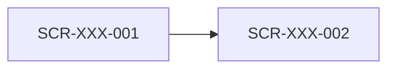

# 정보 구조 (IA)

## 화면 목록

<!-- 행 형식은 crosscheck.sh가 읽는다. refs가 비면 안 된다 -->

| ID | 이름 | 경로 | 접근 역할 | refs |
|---|---|---|---|---|
| SCR-XXX-NNN | <주문서> | </checkout> | <회원, 비회원> | <FR-ORD-001> |

- ID는 라우트가 아니라 사용자가 보는 화면 단위다. 모달과 단계형 폼의 각 단계도 화면이다
- 셸 없는 화면: <SCR-XXX-NNN (로그인)> <!-- 셸(ui/shell.js)을 불러오지 않는 화면. 없으면 "없음" -->

## 메뉴 계층

```text
<홈>
├─ <상품>
└─ <마이페이지>
   └─ <주문 내역>
```

- 셸(`ui/shell.js`)의 메뉴는 이 계층과 같게 적는다. 메뉴를 바꿀 때는 여기를 먼저 고친다
- <메뉴 관리 기능이 있으면: 이 계층은 초기 메뉴다. 운영 중에는 관리자가 바꾼다 (근거: FR-XXX-NNN)>

## 화면 흐름


