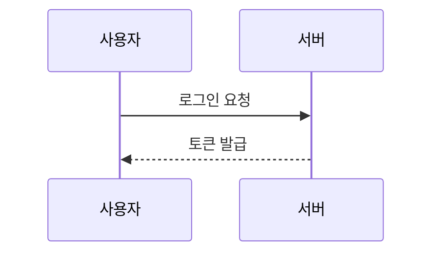

# 보안 설계

<!-- 전역 문서. refs에 반영한 SEC ID를 적는다 -->

## 인증 흐름

## 인가 모델

- 역할별 권한의 정본: `docs/req/actors.md`
- <권한 검사 위치와 방식. 예: API 진입점에서 역할 검사>

## 토큰·세션

| 항목 | 방식 | 근거 |
|---|---|---|
| 저장 위치 | | |
| 만료 | `_policy.md` 참조 | |

## 데이터 보호

| 대상 (테이블.컬럼) | 보호 방식 | 근거 |
|---|---|---|
| <users.phone> | <암호화 / 마스킹 / 해시> | <SEC-PRIV-NNN> |

## 감사 로그

| 이벤트 | 기록 항목 | 근거 |
|---|---|---|

## 금지·제약

- NEVER: <예: 비밀번호를 평문으로 저장하지 않는다>
