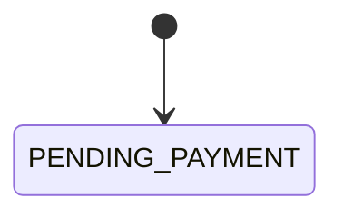

# <엔터티 이름> 상태 전이

- 테이블: <orders.status> (`database/erd.md`)
- 상태값의 정본은 이 문서다. ERD는 이 문서를 참조한다

## 상태

| 상태 | 의미 |
|---|---|
| <PENDING_PAYMENT> | <결제 대기> |

## 전이

<!-- 각 행은 AC 테스트 1개의 기준이 된다 -->

| 현재 | 이벤트 | 다음 | 조건 | 주체 | 부수 효과 | 근거 |
|---|---|---|---|---|---|---|
| <PENDING_PAYMENT> | <결제 승인> | <PAID> | <PG 승인 응답> | <시스템> | <재고 차감> | <FR-ORD-001, API-PAY-001> |

## 금지 전이

- MUST: 표에 없는 전이는 거부한다
- MUST: 종료 상태에서는 전이하지 않는다

## 다른 엔터티와의 연동

- <예: Payment가 APPROVED가 되면 Order를 PAID로 바꾼다 (state/payment.md)>

## 다이어그램

