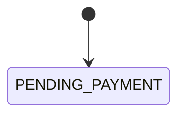

# <도메인 이름> 정책

둘 이상의 기능이 함께 쓰는 규칙과 수치, 상태 전이다. 값의 정의는 이 파일에만 둔다.

## 규칙·수치

| 항목 | 값 | 근거 |
|---|---|---|
| <결제 대기 만료> | <30분> | <인터뷰 답, 또는 〔YYYY-MM-DD〕 이유> |

## 상태 전이: <엔터티 이름>

<!-- 상태가 3개 이상이거나 시간·외부 이벤트로 상태가 바뀌는 엔터티만 둔다 (harness-psw 3.4). 없으면 절을 지운다 -->
<!-- 상태값의 정본은 이 절이다. 코드의 상태 이름은 이 절을 따른다 -->

### 상태

| 상태 | 의미 |
|---|---|
| <PENDING_PAYMENT> | <결제 대기> |

### 전이

<!-- 각 행은 AC 테스트 1개의 기준이 된다 -->

| 현재 | 이벤트 | 다음 | 조건 | 주체 | 부수 효과 | 근거 |
|---|---|---|---|---|---|---|
| <PENDING_PAYMENT> | <결제 승인> | <PAID> | <PG 승인 응답> | <시스템> | <재고 차감> | <FR-ORD-001> |

### 금지 전이

- MUST: 표에 없는 전이는 거부한다
- MUST: 종료 상태에서는 전이하지 않는다

### 다른 엔터티와의 연동

- <예: Payment가 APPROVED가 되면 Order를 PAID로 바꾼다>

